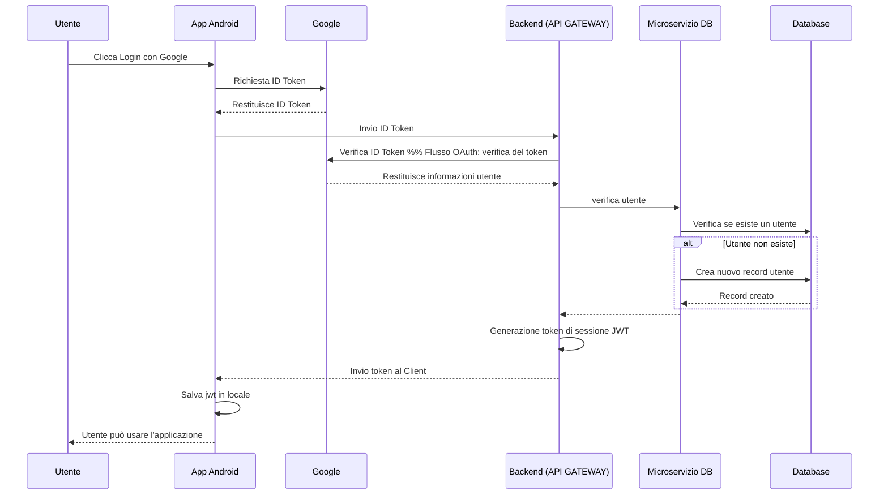

# Flussi di Login con Google

## 1. Primo flusso (Registrazione)



## 2. Secondo flusso (Accesso)
```mermaid

sequenceDiagram
    participant U as Utente
    participant A as App Android
    participant G as Google
    participant B as Backend (API GATEWAY)
    participant MS as Microservizio DB
    participant DB as Database

    U->>A: Clicca Login con Google
    A->>G: Richiesta ID Token
    G-->>A: Restituisce ID Token
    A->>B: Invio ID Token
    B->>G: Verifica ID Token  %% Flusso OAuth: verifica del token
    G-->>B: Restituisce informazioni utente
    B->>MS: verifica utente
    MS->>DB: Verifica se esiste un utente
    alt Utente esiste
        MS->>DB: Recupero dati utente
    end
    DB-->>MS: 
    MS-->>B: 
B->>B: Generazione nuovo token di sessione JWT
    B-->>A: Invio token al Client
    A ->> A: Salva jwt in locale
    A-->>U: Utente può usare l'applicazione

``````